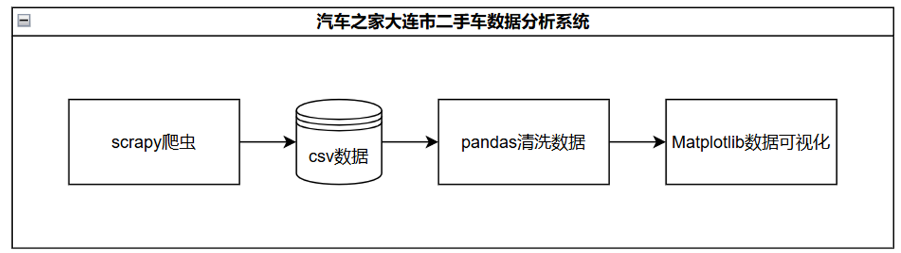

开源地址：[https://github.com/shandianchengzi/car_home_spider](https://github.com/shandianchengzi/car_home_spider)

使用说明：切换到autohome_spider目录下，运行`run.bat`。

# 汽车之家大连市二手车车辆数据爬取、清洗与可视化

## 一、项目简介

本项目旨在通过网络爬虫技术，从“汽车之家”网站的二手车频道自动抓取各类汽车的详细信息，包括品牌、车型、价格、公里数、上牌时间等，然后利用Pandas库对数据进行清洗和可视化分析，为用户提供直观的数据展示和分析结果。通过本项目，用户可以了解到大连市二手车市场的价格分布、常购品牌等信息，为购车提供参考依据。

## 二、项目架构

### 1）运行环境

1.	硬件系统：Intel Core i7, 16GB RAM, NVIDIA GeForce GTX 1050 Ti
2.	操作系统：Windows 10, Version 20H2
3.	软件版本：Python 3.8.5, SQLite 3.31.1, Visual Studio Code 1.57.1
4.	运行时刻：2024年7月13日 23:00

### 3）系统架构图



### 4）数据库设计
数据存入csv文件，包含字段：品牌、上市年份、车型、表显里程（公里）、上牌时间（年）、价格（万）、原厂保修时间、所属城市、链接。

## 三、项目核心代码说明
### 1）Scrapy框架数据爬取
爬取之前，先分析网站信息。

1. 确定网页：在网上汽车之家能找到两个网页是卖二手车的，一个在产品库[^1]里、另一个在二手车严选[^2]上。结果显示，2024年7月13日，产品库中的车源更多，有2714条；而二手车严选里只有1934条。因此，本项目选择产品库中的结果。

2. 确定请求方式：打开开发者工具并刷新，然后搜索页面上的任意车辆的名称，检查返回的结果对应的请求。结果表明，请求方式为Get，请求的就是网站的链接，同时，没有传递任何Get参数。

3. 确定传参模式：

    1. 筛选机制：注意到网页本身拥有排序功能，这样之后就不需要额外排序。它的排序选项不在参数中，在链接中，比较小众。比如[*a0\_0msdgscncgpi1ltocsp2ex/*](https://car.autohome.com.cn/2sc/dalian/a0_0msdgscncgpi1ltocsp2ex/)
        对应默认排序，[*a0\_0msdgscncgpi1lto2cspex/*](https://car.autohome.com.cn/2sc/dalian/a0_0msdgscncgpi1lto2cspex/)
        对应价格降序。

    2. 翻页机制：产品库的二手车页面中，页码也在链接中。比如[*a0\_0msdgscncgpi1lto2csp1ex/*](https://car.autohome.com.cn/2sc/dalian/a0_0msdgscncgpi1lto2csp1ex/)对应第一页，[*a0\_0msdgscncgpi1lto2csp2ex/*](https://car.autohome.com.cn/2sc/dalian/a0_0msdgscncgpi1lto2csp2ex/)对应第二页。

4. 确定结果格式：由于他返回的就是网页，没有json之类的额外信息，所以爬取的结果就是网页上能看到的结果。分析页面内容，可知包含的信息为“品牌”、“上市年份”、“车型”、“实物图”、“表显里程”、“上牌时间”、“价格”、“原厂保修时间”、“所属城市”和详细信息的访问链接。观察到图片采用了懒加载技术，需要额外请求别的链接才能返回，加之数据分析时并不需要图片，因此干脆去掉实物图这一个信息。

5. 额外注意事项：特别坑的一点是，页数超过100页时会自动重定向回到100页，而不是返回空，这样代码中加空判断就无法真正停止下来。这里得额外写一个100页的判断。而且也因为这个，最多返回结果数量2400条。考虑到总共也只有2714条，可以认为该数量是可以接受的，因此不更改筛选条件重新跑了。

分析好了这些内容之后，再开始用Scrapy写爬虫，代码如下：

1. Spider中数据爬取解析：

```python
class AutohomeSpider(scrapy.Spider):
    name = 'autohome_spider'
    allowed_domains = ['autohome.com.cn']
    base_url = 'https://car.autohome.com.cn/2sc/dalian/a0_0msdgscncgpi1lto2csp{}ex/'
    page = 1
    start_urls = ['https://car.autohome.com.cn/2sc/dalian/a0_0msdgscncgpi1lto2csp1ex/']

    def parse(self, response):
        xml = lxml.etree.HTML(response.text)
        piclist = xml.xpath('//div[@class="piclist"]/ul/li')
        if len(piclist) == 0 or self.page > 100: # max page 100
            return
        for car in piclist:
            try:
                l = ItemLoader(item=AutohomeItem())
                title = car.xpath('div[@class="title"]/a/text()')[0]
                title_href = car.xpath('div[@class="title"]/a/@href')[0]
                somethings = title.split(' ', 2)
                if len(somethings) != 3:
                    with open('error.log', 'a') as f:
                        f.write(title + '\n')
                    continue
                # 获得icon_list里所有a标签的title属性并拼接非空的为字符串
                icon_list = car.xpath('div[@class="icon-list"]/a')
                city = car.xpath('div[@class="icon-list"]/span/span/text()')[0]
                icons_info = []
                for icon in icon_list:
                    icon_info = icon.xpath('@title')
                    if icon_info:
                        icons_info.extend(icon_info)
                icons_info = ', '.join(icons_info)
                # 用ItemLoader加载数据
                l.add_value('brand', somethings[0])
                l.add_value('year', somethings[1])
                l.add_value('model', somethings[2])
                l.add_value('mileage', getNumberAndFloat(car.xpath('*/div[@class="detail-l"]/p[1]/text()')[0]))
                l.add_value('registration_time', getNumberAndFloat(car.xpath('*/div[@class="detail-l"]/p[2]/text()')[0]))
                l.add_value('price', car.xpath('*/div[@class="detail-r"]/span/text()'))
                l.add_value('warranty_time', icons_info)
                l.add_value('city', city)
                l.add_value('link', "https:" + title_href)
                yield l.load_item()
            except Exception as e:
                # skip no full information car
                pass

        # 下一页
        self.page += 1
        new_url = self.base_url.format(self.page)
        yield scrapy.Request(new_url, callback=self.parse)
```

2.	Pipeline中做数据存储：
```python
class AutohomeSpiderPipeline:
    def open_spider(self, spider):
        self.file = open('autohome.csv', 'w', newline='', encoding='utf-8')
        self.writer = csv.DictWriter(self.file, fieldnames=['brand', 'year', 'model', 'mileage', 'registration_time', 'price', 'warranty_time', 'city', 'link'])
        # ['品牌', '上市年份', '车型', '表显里程（公里）', '上牌时间（年）', '价格（万）', '原厂保修时间', '所属城市', '链接']
        self.writer.writeheader()

    def close_spider(self, spider):
        self.file.close()

    def process_item(self, item, spider):
        # let item: {field: [value]} to {field: value}
        item = {k: v[0] for k, v in item.items()}
        self.writer.writerow(item)
        return item
```
### 2）Pandas数据清洗与可视化
数据清洗主要是将错误的数据修改正确或者删除，以便进一步分析。我在爬虫代码的解析过程中，对品牌的解析有误，有一些品牌的名称，本身就带空格，我用空格做分割，导致该列被解析到下一列中。代码如下：

```python
# 数据清洗
df.drop_duplicates(inplace=True) # 去重
df.dropna(subset=['brand'], inplace=True) # 去掉品牌为空的数据
# 合并前三列的数据形成字符串，用正则重新解析，查找"xxxx款"，该字符串前面的是brand，后面的是model，中间的是year
df['brand_model_year'] = df['brand'] + df['year'] + df['model'] # 辅助列
df['brand'] = df['brand_model_year'].str.extract(r'^(.*?)(\d{4}款)(.*)')[0]
df['year'] = df['brand_model_year'].str.extract(r'^(.*?)(\d{4}款)(.*)')[1]
df['model'] = df['brand_model_year'].str.extract(r'^(.*?)(\d{4}款)(.*)')[2]
df.drop(columns=['brand_model_year'], inplace=True)
df['year'] = df['year'].replace('款', '', regex=True)
# 如果原厂保修时间为空，填充为0
df['warranty_time'].fillna('0', inplace=True)
df.to_csv(result_path, index=False, encoding='gbk') # for windows excel
```

### 3）Matplotlib数据可视化
多角度可视化代码如下：

```python
# 数据可视化
df.columns = ['品牌', '上市年份', '车型', '表显里程（公里）', '上牌时间（年）', '价格（万）', '原厂保修时间', '所属城市', '链接']
# 设置字体
plt.rcParams['font.sans-serif'] = ['SimHei']
plt.rcParams['axes.unicode_minus'] = False
# 1. 各种数据的占比统计，全画在一张图上
plt.figure(figsize=(20, 10))
# 1.1 价格分布(只做0~200万的)
plt.subplot(2, 2, 1)
sns.histplot(df['price'], bins=20, kde=True)
plt.xlim(0, 200)
plt.title('价格分布')
# 1.2 里程分布
plt.subplot(2, 2, 2)
sns.histplot(df['mileage'], bins=20, kde=True)
plt.title('里程分布')
# 1.3 品牌分布（前20，扇形图，不要x和y的label）
plt.subplot(2, 2, 3)
df['brand'].value_counts().head(20).plot.pie(autopct='%1.1f%%')
plt.ylabel('')
plt.title('品牌数量分布（前20）')
# 1.4 车型分布(前10，扇形图，不要x和y的label)
plt.subplot(2, 2, 4)
df['model'].value_counts().head(10).plot.pie(autopct='%1.1f%%')
plt.ylabel('')
plt.title('车型数量分布（前10）')
plt.savefig(os.path.join(imgs_dir, '各种数据的占比统计.png'))
# 2 时间分析
plt.figure(figsize=(20, 10))
# 2.1 上牌时间分布
plt.subplot(1, 2, 1)
sns.histplot(df['registration_time'], bins=20, kde=True)
plt.title('上牌时间分布')
# 2.2 上市年份分布
plt.subplot(1, 2, 2)
sns.histplot(df['year'], bins=20, kde=True)
plt.title('上市年份分布')
plt.savefig(os.path.join(imgs_dir, '时间分析.png'))
# 3. 保修存在性与其他数据的关系，标好图例
plt.figure(figsize=(20, 10))
# 3.1 保修存在占比（1表示存在，0表示不存在，扇形图）
plt.subplot(2, 2, 1)
df['warranty_time_exist'].value_counts().plot.pie(autopct='%1.1f%%')
plt.legend(['无保修', '有保修'])
plt.ylabel('')
plt.title('保修存在占比')
# 3.2 保修存在与价格的关系
plt.subplot(2, 2, 2)
sns.boxplot(x='warranty_time_exist', y='price', data=df)
plt.xticks([0, 1], ['无保修', '有保修'])
plt.title('保修存在与价格的关系')
# 3.3 保修存在与里程的关系
plt.subplot(2, 2, 3)
sns.boxplot(x='warranty_time_exist', y='mileage', data=df)
plt.xticks([0, 1], ['无保修', '有保修'])
plt.title('保修存在与里程的关系')
# 3.4 保修存在与上牌时间的关系
plt.subplot(2, 2, 4)
sns.boxplot(x='warranty_time_exist', y='registration_time', data=df)
plt.xticks([0, 1], ['无保修', '有保修'])
plt.title('保修存在与上牌时间的关系')
plt.savefig(os.path.join(imgs_dir, '保修是否存在与其他数据的关系.png'))
```

## 四、项目运行截图
### 1）	爬虫结果截图


### 2）	持久化存储结果截图


### 3）	可视化分析图形截图

价格、里程、品牌和车型数量分布可视化


上牌时间和上市时间分布


保修的存在性与价格、里程和上牌时间的关联


## 五、总结
通过本项目，我学习并掌握了网络爬虫的基本原理和方法，以及如何利用Python进行数据处理和可视化分析。在项目中，我使用Scrapy框架爬取了汽车之家网站的二手车信息，然后利用Pandas库对数据进行清洗和整理，最后使用Matplotlib库对数据进行可视化分析。通过这个项目，我不仅提高了自己的数据处理和分析能力，还为大连市二手车市场的价格分布、常购品牌等信息提供了直观的展示和分析结果，为购车提供了参考依据。

## 六、参考资料
-   [Requests官方文档](https://docs.python-requests.org/en/master/)：[*https://docs.python-requests.org/en/master/*](https://docs.python-requests.org/en/master/)

-   [BeautifulSoup官方文档](https://www.crummy.com/software/BeautifulSoup/bs4/doc/)：[*https://www.crummy.com/software/BeautifulSoup/bs4/doc/*](https://www.crummy.com/software/BeautifulSoup/bs4/doc/)

-   [通义千问AI问答](https://lxblog.com/qianwen/share?shareId=6f7c1cba-e39f-4e1e-8b59-b7477e346fa9)：[*https://lxblog.com/qianwen/share?shareId=6f7c1cba-e39f-4e1e-8b59-b7477e346fa9*](https://lxblog.com/qianwen/share?shareId=6f7c1cba-e39f-4e1e-8b59-b7477e346fa9)

-   [Scrapy笔记（5）- Item详解\_scrapy
    item-CSDN博客](https://blog.csdn.net/sdulsj/article/details/52984619#SnippetTab)：[*https://blog.csdn.net/sdulsj/article/details/52984619\#SnippetTab*](https://blog.csdn.net/sdulsj/article/details/52984619#SnippetTab)

-   [Python爬虫实战+数据分析+数据可视化（汽车之家）\_基于大数据技术对汽车交易的可视化分析汽车之家-CSDN博客](https://blog.csdn.net/qq_45821420/article/details/115366180)：[*https://blog.csdn.net/qq\_45821420/article/details/115366180*](https://blog.csdn.net/qq_45821420/article/details/115366180)

-   [python爬虫学习笔记-scrapy框架之start\_url\_scrapy的start
    url-CSDN博客](https://blog.csdn.net/weixin_42672765/article/details/85380212)：[*https://blog.csdn.net/weixin\_42672765/article/details/85380212*](https://blog.csdn.net/weixin_42672765/article/details/85380212)


[^1]: [*https://car.autohome.com.cn/2sc/dalian/a0\_0msdgscncgpi1lto2csp1ex/*](https://car.autohome.com.cn/2sc/dalian/a0_0msdgscncgpi1lto2csp1ex/)

[^2]: [*https://www.che168.com/dalian/list/\#pvareaid=100945*](https://www.che168.com/dalian/list/#pvareaid=100945)
